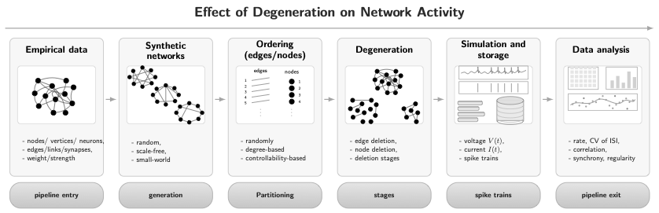

# Network Degeneration and Simulation Pipeline

 

## Overview

```
Generate / Load Network
        ↓
Edge Ordering (Max-Matching Decomposition)
        ↓
Degeneration (Synapse / Neuron, staged)
        ↓
Weighting (E/I 4-block scaling)
        ↓
Simulation/Parallelizing + Analysis
        ↓
Stacking output
```

This repository implements a **network-centric simulation pipeline** for studying how **structural degeneration** affects **dynamical activity** in spiking neuronal networks.

---

## 1. Presimulation (Structure-first)

Operations in this phase act **purely on network structure** — graphs, edges, nodes, and weights — without any neural dynamics.

**Data objects:** adjacency matrices, edge lists, node indices, weight matrices.

Main steps:

- **Network generation**  
  Creation of directed E/I networks, either synthetic (null models) or empirical-inspired.

- **Edge ordering**  
  Deterministic ordering of network edges using **maximum matching decomposition**, producing a reproducible edge sequence.

- **Network degeneration**  
  Stage-wise structural degradation:
  - *Synaptic pruning* (edge removal)
  - *Neuron deletion* (node removal)  
  applied according to the ordered edge list.

- **Weight assignment**  
  Block-wise synaptic scaling (II, IE, EI, EE) to produce weighted connectivity matrices.

At the end of this phase, the pipeline yields **degenerating network instances** ready for simulation.


---

## 2. Simulation & Postsimulation (Dynamics + Analysis)

Once a network instance is fixed, the pipeline proceeds to neural dynamics and analysis.

**Data objects:** spike trains, time series, activity statistics and networks

Main steps:

- **Simulation**  
  Spiking network simulation (currently via **NEST**), producing:
  - Spike trains
  - Time series (e.g. membrane voltage, synaptic currents)

- **Postsimulation analysis**  
  Extraction of two complementary classes of observables:

  **Activity-based measures**
  - Firing rates, 
  - Coefficient of Variation in ISI
  - Synchrony metrics
  - Pairwise spiking correlation

  **Structure-based measures**
  - Degree statistics
  - Weighted sums
  - pairwise common presynaptic neighbours
  - Spectral radius
  - Block-level connectivity summaries

All observables are stored as structured `.npz` files and later **aggregated across the full parameter grid** into high-dimensional arrays for downstream analysis.

---


## Outlook

Planned next steps include:
- Formal Snakemake workflows
- feature correlation and prediction analysis

---


